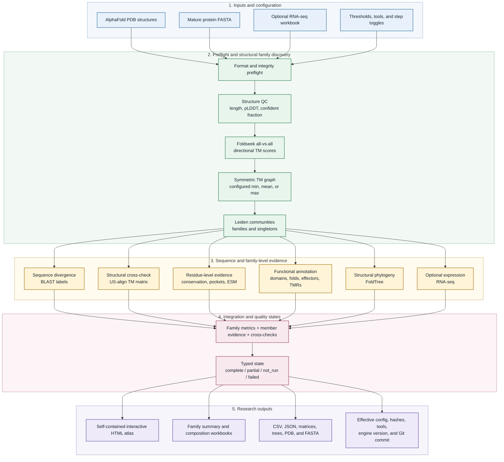
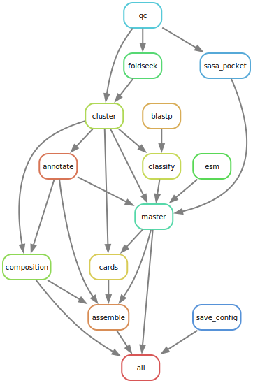

# SUSS Protein Atlas

**A reproducible Snakemake workflow and intranet portal for discovering sequence-unrelated,
structurally similar protein families in secreted effector repertoires.**

[](https://github.com/lhchen010/SUSS_protein_Atlas/actions/workflows/ci.yml)
[](https://github.com/lhchen010/SUSS_protein_Atlas/releases/latest)
[](LICENSE)

SUSS Protein Atlas starts from predicted protein structures for one strain, builds
structure-defined families, labels their sequence-divergence spectrum, and integrates independent
structural validation, conservation, pockets, mutational tolerance, phylogeny, annotation, and
optional expression into a self-contained interactive atlas.

> **SUSS = Sequence-Unrelated, Structurally Similar.** A SUSS label identifies a structural edge
> that passes the configured Foldseek TM threshold but is not detected by BLAST at the configured
> e-value. BLAST labels divergence; it never splits a structure-defined family.

## At a glance

| Question | Implementation |
|---|---|
| What defines a family? | Foldseek all-vs-all structural edges followed by Leiden community detection |
| What defines a SUSS relationship? | Structural similarity with no BLAST-detected relationship at the configured threshold |
| How is structure independently checked? | Within-family US-align TM matrices, complete-pair validation, and Foldseek/US-align agreement |
| What biological evidence is integrated? | Rate4Site, fpocket, P2Rank, ESM-Scan, FoldTree, InterProScan, EffectorP, DeepTMHMM, and optional RNA-seq |
| What is delivered? | Offline interactive HTML, Excel summaries, machine-readable tables, per-family assets, and run provenance |
| How is it orchestrated? | Snakemake checkpoint expansion after the family count becomes known |

## Workflow



The diagram above shows the scientific data flow. The exact rule-level graph remains available
for workflow development:

<details>
<summary>Show the Snakemake rule DAG</summary>



</details>

## Outputs

| Output | Purpose |
|---|---|
| `results/<atlas_name>.html` | Self-contained interactive family network and integrated evidence cards |
| `results/family_summary.xlsx` | Clustered families and singletons with members, evidence, TM statistics, SUSS labels, pockets, and expression |
| `results/cluster_composition.xlsx` | Family membership and annotation composition |
| `results/all_families_master.csv` | Machine-readable integrated family table |
| `results/member_annotation.csv` | Per-protein annotation values and component execution states |
| `results/families/<family>/` | Downloadable family workbook with per-member annotation, Foldseek and US-align matrices, BLAST similarity, complete pocket outputs, FoldTree trees, conservation, structures, and RNA-seq |
| `results/used_config.yaml` | Effective configuration plus input hashes, resolved tools, engine version, and Git commit |

## Interactive network search

The atlas network toolbar searches every clustered family without a server round trip. Plain text
matches family IDs, member accessions, annotation names, InterPro/Pfam terms, structural hits,
EffectorP calls, transmembrane predictions, novelty calls, and family metrics. Field prefixes are
available for precise queries:

| Prefix | Example |
|---|---|
| `gene:` / `acc:` | `gene:TDZ13877.1` |
| `annotation:` | `annotation:Peroxidase` |
| `effectorp:` | `effectorp:non-effector` |
| `tmr:` / `deeptmhmm:` | `tmr:1` |
| `structtm:` | `structtm:0.65` |
| `family:` / `novel:` / `suss:` | `family:F2` |

Matching clusters retain their scientific color and receive an orange outline; non-matches are
visually muted. Press Enter to open a unique result or fit multiple matches, and Escape to reset.

## Quickstart

### 1. Create the environment

```bash
conda env create -f environment.yml
conda activate suss-atlas
```

Install the separately distributed tools needed for the analyses you plan to enable, then set
their paths in the config. See [INSTALL.md](INSTALL.md) for US-align, FoldTree, P2Rank,
ESM-Scan, EffectorP, DeepTMHMM, InterProScan, and database setup.

### 2. Run the validated example

```bash
snakemake \
  --configfile examples/config.example.yaml \
  --cores 8 \
  results/example_suss_atlas.html
```

The bundled dataset contains 100 *Colletotrichum orbiculare* proteins. Compare family counts,
sizes, US-align completeness, and tree outputs with [examples/EXPECTED.md](examples/EXPECTED.md).

### 3. Run a new strain

```bash
cp config/config.yaml.template config/config.yaml
# Edit strain metadata, input paths, enabled steps, and tool paths.

snakemake --configfile config/config.yaml --cores 16
```

## Inputs

| Input | Required | Notes |
|---|---:|---|
| `input/pdb/<code>_<accession>.pdb` | Yes | Mature AlphaFold structures; signal peptide removed |
| `input/seqs.fasta` | Recommended | Mature sequences; missing entries are derived from structure residues |
| `input/rnaseq.xlsx` | No | Sheets `id_mapping` and `expression`; templates are in `templates/` |
| `config/config.yaml` | Yes | Strain metadata, thresholds, step toggles, tool paths, and output settings |

The preflight blocks empty or malformed structure sets before expensive analyses begin. The
current accession parser is designed for versioned GenBank-style IDs; see the handoff report for
known extension points if you need UniProt, JGI, Ensembl, or arbitrary identifiers.

## Failure and optional-step semantics

SUSS Atlas does not use zero matrices, empty trees, or blank files to represent failed tools.

| Situation | Recorded behavior |
|---|---|
| Step disabled | Typed output with `not_run`; unavailable scientific calls remain null |
| Optional component omitted | Parent analysis may be `partial`; completed components remain usable |
| Configured tool missing or unsuccessful | Rule fails with a diagnostic log |
| Tool reports success but expected output is incomplete | Rule fails validation |
| Annotation evidence incomplete | `novel` remains null rather than becoming a false positive |

This distinction is carried into member tables, family summaries, the atlas, and provenance.

## Web portal

The included portal provides an internal-network upload workflow with persistent history, live
logs, original-input downloads, run parameters, and generated atlas/Excel downloads.

```bash
cd portal
python3 suss_portal.py
```

The portal enforces upload and expanded-archive limits, safe archive extraction, a configurable
active-job limit, CSRF-protected deletion, and UUID job IDs. It is intended for a trusted intranet
or Tailscale network; it does not provide public-service authentication or user isolation. See
[portal/DEPLOY.md](portal/DEPLOY.md).

## Platform support

The core workflow supports Linux and macOS. InterProScan is the main native-platform exception:
its official local distribution is 64-bit Linux. On macOS, leave `tools.interproscan` blank or use
Docker/the EBI service; fold and effector evidence can still run, while novelty remains uncalled
unless all required evidence is complete.

## Documentation

| Document | Contents |
|---|---|
| [INSTALL.md](INSTALL.md) | Environment, external tools, databases, and DeepTMHMM compatibility |
| [config/README.md](config/README.md) | Configuration fields and step behavior |
| [examples/EXPECTED.md](examples/EXPECTED.md) | Reproducible 100-protein acceptance baseline |
| [docs/pipeline_io_contract.md](docs/pipeline_io_contract.md) | Rule inputs, outputs, parameters, and contracts |
| [docs/CLAUDE_FOR_SCIENCE_HANDOFF.md](docs/CLAUDE_FOR_SCIENCE_HANDOFF.md) | v1.0.1 validation, deployment evidence, known limitations, and rollback |
| [portal/DEPLOY.md](portal/DEPLOY.md) | Intranet portal deployment and operational scope |

## Citation and licenses

SUSS Atlas integrates Foldseek, FoldMason, US-align, TM-align, FoldTree, Rate4Site, fpocket,
P2Rank, ESM-1b/ESM-Scan, InterProScan, EffectorP, DeepTMHMM, Leiden, and Snakemake. Cite the
underlying methods used in your enabled analysis; installation notes are collected in
[INSTALL.md](INSTALL.md).

<details>
<summary>Methods and tools to cite</summary>

- **Foldseek** — van Kempen et al., *Nature Biotechnology* 2024
- **FoldMason** — Gilchrist et al., 2024
- **US-align** — Zhang et al., *Nature Methods* 2022
- **TM-align** — Zhang and Skolnick, *Nucleic Acids Research* 2005
- **FoldTree** — Moi et al., 2023
- **Rate4Site** — Pupko et al., *Bioinformatics* 2002
- **fpocket** — Le Guilloux et al., *BMC Bioinformatics* 2009
- **P2Rank** — Krivák and Hoksza, *Journal of Cheminformatics* 2018
- **ESM-1b / ESM-Scan** — Rives et al., *PNAS* 2021
- **InterProScan** — Jones et al., *Bioinformatics* 2014
- **EffectorP** — Sperschneider and Dodds, 2022
- **DeepTMHMM** — Hallgren et al., 2022
- **Leiden** — Traag et al., *Scientific Reports* 2019
- **Snakemake** — Mölder et al., 2021

</details>

The pipeline code is released under the [MIT License](LICENSE). Third-party tools, models, and
databases retain their own licenses; obtain license-gated components from their official sources.
