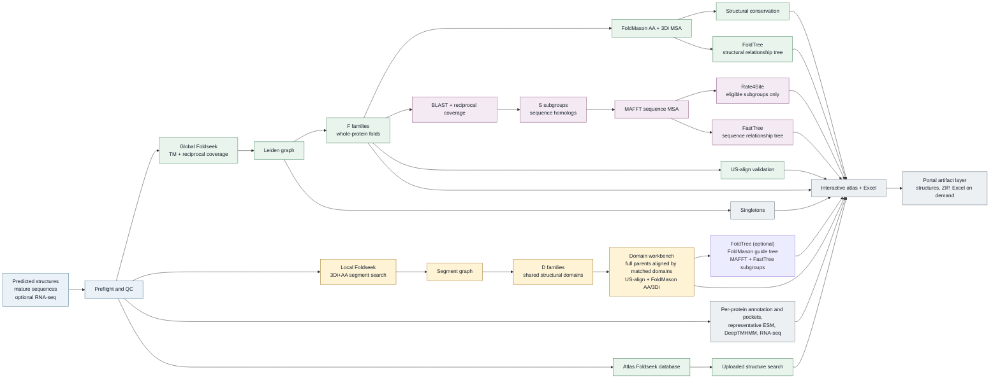
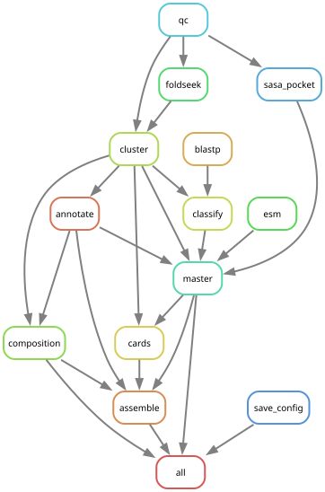

# SUSS Protein Atlas

**A reproducible Snakemake workflow and intranet portal for discovering sequence-unrelated,
structurally similar protein families in secreted effector repertoires.**

[](https://github.com/lhchen010/SUSS_protein_Atlas/actions/workflows/ci.yml)
[](https://github.com/lhchen010/SUSS_protein_Atlas/releases/latest)
[](LICENSE)

SUSS Protein Atlas starts from predicted protein structures for one strain, builds
structure-defined families, labels their sequence-divergence spectrum, and integrates independent
structural validation, conservation, pockets, mutational tolerance, phylogeny, annotation, and
optional expression into an interactive atlas. Version 5 separates three questions that should
not be collapsed into one clustering label: full-length fold families (`F`), local structural
domain families (`D`), and sequence-homologous subgroups (`S`). D families now use the same
evidence-oriented workbench as F families: complete-parent superposition driven by matched domain
coordinates, FoldMason AA/3Di MSA, independent US-align matrices, structural and sequence trees,
conservation, per-protein pockets, representative ESM scans, RNA-seq, annotation, and complete downloads. Every F/D
relationship is bidirectionally linked. Unclustered proteins remain independent records, and
portal atlases load large structures and downloads on demand.

> **SUSS = Sequence-Unrelated, Structurally Similar.** A SUSS label identifies a structural edge
> that passes the configured Foldseek TM threshold but is not detected by BLAST at the configured
> e-value. BLAST labels divergence; it never splits a structure-defined family.

## At a glance

| Question | Implementation |
|---|---|
| What defines an F family? | Global Foldseek TM similarity plus reciprocal coverage, followed by Leiden community detection |
| What defines a D family? | Significant local Foldseek 3Di+AA segment matches; D families are independent of F families |
| What defines an S subgroup? | Reciprocal-coverage-controlled BLAST links within an F family |
| What defines a SUSS relationship? | Structural similarity with no BLAST-detected relationship at the configured threshold |
| How is structure independently checked? | Within-F-family and cropped-D-family US-align TM matrices, complete-pair validation, and Foldseek/US-align agreement |
| Which alignments are used? | FoldMason AA/3Di structural MSA for fold correspondence; MAFFT sequence MSA for eligible S subgroups |
| When is Rate4Site used? | Only when the representative protein belongs to a sufficiently large sequence-homologous subgroup |
| How is structural conservation scored? | Official FoldMason per-column LDDT; columns lacking the configured pair support remain unscored |
| What biological evidence is integrated? | Structural conservation, Rate4Site, fpocket, P2Rank, ESM-Scan, FoldTree, sequence tree, annotation, and optional RNA-seq |
| How are singletons handled? | As independent proteins with sequence viewer/download, structure, pockets, ESM, annotation, Foldseek database hits, and optional RNA-seq; no artificial singleton cluster or pairwise family analyses |
| What is delivered? | Linked F/D/unassigned/singleton workspaces, a searchable Foldseek database, domain and parent ZIPs, Excel workbooks, machine-readable tables, and provenance |
| How is it orchestrated? | Snakemake checkpoint expansion after the family count becomes known |

## Workflow


```mermaid
flowchart LR
    INPUT["Predicted structures<br/>mature sequences<br/>optional RNA-seq"] --> QC["Preflight and QC"]

    QC --> GLOBAL["Global Foldseek<br/>TM + reciprocal coverage"]
    GLOBAL --> FGRAPH["Leiden graph"]
    FGRAPH --> F["F families<br/>whole-protein folds"]
    FGRAPH --> SINGLE["Singletons"]

    QC --> LOCAL["Local Foldseek<br/>3Di+AA segment search"]
    LOCAL --> DGRAPH["Segment graph"]
    DGRAPH --> D["D families<br/>shared structural domains"]
    D --> DWB["Domain workbench<br/>full parents aligned by matched domains<br/>US-align + FoldMason AA/3Di"]
    DWB --> DTREE["FoldTree (optional)<br/>FoldMason guide tree<br/>MAFFT + FastTree subgroups"]

    F --> FM["FoldMason AA + 3Di MSA"]
    FM --> SCONS["Structural conservation"]
    FM --> FT["FoldTree<br/>structural relationship tree"]
    F --> BLAST["BLAST + reciprocal coverage"]
    BLAST --> S["S subgroups<br/>sequence homologs"]
    S --> MAFFT["MAFFT sequence MSA"]
    MAFFT --> R4S["Rate4Site<br/>eligible subgroups only"]
    MAFFT --> STREE["FastTree<br/>sequence relationship tree"]
    F --> USA["US-align validation"]

    QC --> SHARED["Per-protein annotation and pockets,<br/>representative ESM, DeepTMHMM, RNA-seq"]
    F --> ATLAS["Interactive atlas + Excel"]
    DWB --> ATLAS
    DTREE --> ATLAS
    SINGLE --> ATLAS
    SCONS --> ATLAS
    FT --> ATLAS
    R4S --> ATLAS
    STREE --> ATLAS
    USA --> ATLAS
    SHARED --> ATLAS

    QC --> DB["Atlas Foldseek database"]
    DB --> SEARCH["Uploaded structure search"]
    SEARCH --> ATLAS
    ATLAS --> LAZY["Portal artifact layer<br/>structures, ZIP, Excel on demand"]

    classDef input fill:#eaf2f8,stroke:#3f6f8f,color:#17212b;
    classDef structure fill:#e8f4ec,stroke:#3e7f58,color:#17212b;
    classDef domain fill:#fff3d6,stroke:#9a721d,color:#17212b;
    classDef sequence fill:#f4eaf3,stroke:#8c547d,color:#17212b;
    classDef output fill:#edf0f3,stroke:#5f707a,color:#17212b;
    class INPUT,QC input;
    class GLOBAL,FGRAPH,F,FM,SCONS,FT,USA,DB,SEARCH structure;
    class LOCAL,DGRAPH,D,DWB domain;
    class BLAST,S,MAFFT,R4S,STREE sequence;
    class SINGLE,SHARED,ATLAS,LAZY output;
```

The diagram above shows the scientific data flow. The exact rule-level graph remains available
for workflow development:

<details>
<summary>Show the Snakemake rule DAG</summary>



</details>

## Outputs

| Output | Purpose |
|---|---|
| `results/<atlas_name>.html` | Interactive full-length and domain-family networks, domain-segment workbench, singleton workbench, and integrated evidence panels |
| `results/family_summary.xlsx` | Clustered families and singletons with members, evidence, TM statistics, SUSS labels, pockets, and expression |
| `results/cluster_composition.xlsx` | Family membership and annotation composition |
| `results/domain_families.csv` / `domain_members.csv` | Local structural-domain family summaries and protein segment coordinates |
| `results/domain_edges.csv` / `domain_cross_edges.csv` | Segment-level local Foldseek evidence and aggregated structural bridges between D families |
| `results/domain_workbench.json` | Per-D-family FoldMason/MAFFT alignments, independent trees, US-align matrices/transforms, conservation, statuses, and download metadata |
| `results/domain_families/<D family>/` | Cropped structures, parent/segment FASTA, FoldMason assets, US-align matrices, optional FoldTree output, and auditable status files |
| `results/sequence_subgroups.csv` | Sequence-homologous subgroups nested within full-length structural families |
| `results/structure_db/atlas*` | Foldseek database used by the portal structure-search endpoint |
| `results/structure_search_index.csv` | Protein-to-F/D/S/singleton lookup table for structure-search results |
| `results/all_families_master.csv` | Machine-readable integrated family table |
| `results/member_annotation.csv` | Per-protein annotation values and component execution states |
| `results/downloads/` | Server-backed family workbooks and structure ZIP files when `output.html_mode: backend` |
| `results/families/<family>/` | Workbook and files for Foldseek/US-align, BLAST, FoldMason AA/3Di MSA, MAFFT MSA, structural and evolutionary conservation, structural/sequence trees, pockets, annotation, structures, and RNA-seq |
| Singleton downloads | Mature-sequence FASTA plus an evidence workbook with annotation, Foldseek PDB100/AFDB hits and TM scores, pockets, and RNA-seq; family-only matrices, MSA, FoldTree, conservation, and superposition are intentionally absent |
| `results/used_config.yaml` | Effective configuration plus input hashes, resolved tools, engine version, and Git commit |

## Interactive atlas search

The combined atlas has four relationship views:

- **Full-length families** searches and highlights global fold-defined `F` families.
- **Domain families** provides a D-family overview network. Edges summarize retained local
  Foldseek hits that bridge two D communities. Opening a D family reveals its segment-level
  network and a single member checklist. One checked member shows its complete parent protein
  with the matched domain highlighted; multiple checked members can be superposed using the
  domain coordinates while retaining every complete parent. FoldTree structural trees,
  FoldMason guide trees, and MAFFT/FastTree sequence trees are displayed as separate evidence
  types. FoldMason AA/3Di, US-align, conservation, mapped pockets/ESM, RNA-seq, annotation,
  domain/full structures, FASTA, Excel, and complete-package ZIP downloads are included.
- **No D-family match** lists proteins without a retained local domain-family link under the
  current thresholds. This is not interpreted as evidence that a protein contains no domains.
- **Singletons** provides a sortable, paginated table with filters for effector calls, novelty,
  pockets, and transmembrane helices. Selecting a row opens structure, pocket, ESM, RNA-seq, and
  direct annotation evidence for that protein.

Every F family exposes mature sequences, a FoldMason AA structural MSA, the corresponding 3Di
MSA, and, when applicable, a MAFFT sequence MSA for the representative protein's S subgroup.
Structural conservation uses FoldMason's official per-column LDDT output. By default, a column is
colored only when at least half of structure-pair subalignments support it; unsupported residues
are grey rather than being interpreted as variable or conserved. Red is high structural
conservation and blue is low structural conservation. Evolutionary conservation is reported
separately and remains unavailable when Rate4Site lacks a sufficiently large homologous subgroup.
A singleton exposes its one mature sequence; pairwise family analyses are omitted. A full-length
singleton can still belong to a D family when one local region matches domains in other proteins.

The portal offers `Full-length`, `Domain-aware`, and `Combined` analysis scopes. All scopes produce
one HTML. Combined is recommended because one D family may bridge several F families and one F
family may contain several D families.

The portal also accepts a PDB or mmCIF query after a run completes. It searches that run's
Foldseek database and maps each hit directly to its F family or singleton, D-family memberships,
and S subgroup. Result accessions and family identifiers link directly back to the corresponding
atlas workbench.

All three views search locally without a server round trip. Plain text matches accessions, annotations,
InterPro/Pfam terms, Foldseek PDB100 and AFDB/Swiss-Prot hits, EffectorP calls, DeepTMHMM results,
novelty, pockets, and expression. Field prefixes are available for precise queries:

| Prefix | Example |
|---|---|
| `gene:` / `acc:` | `gene:TDZ13877.1` |
| `annotation:` | `annotation:Peroxidase` |
| `effectorp:` | `effectorp:non-effector` |
| `tmr:` / `deeptmhmm:` | `tmr:1` |
| `pdb:` / `afdb:` / `foldseek:` | `afdb:hydrolase` |
| `pocket:` / `rnaseq:` | `pocket:p2rank` |
| `structtm:` | `structtm:0.65` |
| `family:` / `novel:` / `suss:` | `family:F2` |

Matching clusters retain their scientific color and receive an orange outline; non-matches are
visually muted. Press Enter to open a unique result or fit multiple matches, and Escape to reset.

## Quickstart

### 1. Create the environment

```bash
conda env create -f environment.yml
conda activate suss-atlas
```

Install the separately distributed tools needed for the analyses you plan to enable, then set
their paths in the config. See [INSTALL.md](INSTALL.md) for US-align, FoldTree, P2Rank,
ESM-Scan, EffectorP, DeepTMHMM, InterProScan, and database setup.

### 2. Run the validated example

```bash
snakemake \
  --configfile examples/config.example.yaml \
  --cores 8 \
  results/example_suss_atlas.html
```

The bundled dataset contains 100 *Colletotrichum orbiculare* proteins. Compare family counts,
sizes, US-align completeness, and tree outputs with [examples/EXPECTED.md](examples/EXPECTED.md).

### 3. Run a new strain

```bash
cp config/config.yaml.template config/config.yaml
# Edit strain metadata, input paths, enabled steps, and tool paths.

snakemake --configfile config/config.yaml --cores 16
```

## Inputs

| Input | Required | Notes |
|---|---:|---|
| `input/pdb/<code>_<accession>.pdb` | Yes | Mature AlphaFold structures; signal peptide removed |
| `input/seqs.fasta` | Recommended | Mature sequences; missing entries are derived from structure residues |
| `input/rnaseq.xlsx` | No | Sheets `id_mapping` and `expression`; templates are in `templates/` |
| `config/config.yaml` | Yes | Strain metadata, thresholds, step toggles, tool paths, and output settings |

The preflight blocks empty or malformed structure sets before expensive analyses begin. The
current accession parser is designed for versioned GenBank-style IDs; see the handoff report for
known extension points if you need UniProt, JGI, Ensembl, or arbitrary identifiers.

## Failure and optional-step semantics

SUSS Atlas does not use zero matrices, empty trees, or blank files to represent failed tools.

| Situation | Recorded behavior |
|---|---|
| Step disabled | Typed output with `not_run`; unavailable scientific calls remain null |
| Optional component omitted | Parent analysis may be `partial`; completed components remain usable |
| Configured tool missing or unsuccessful | Rule fails with a diagnostic log |
| Tool reports success but expected output is incomplete | Rule fails validation |
| Annotation evidence incomplete | `novel` remains null rather than becoming a false positive |

This distinction is carried into member tables, family summaries, the atlas, and provenance.

## Web portal

The included portal provides an internal-network upload workflow with persistent history, live
logs, original-input downloads, run parameters, and generated atlas/Excel downloads. Portal runs
default to `output.html_mode: backend`: the HTML contains the interactive data model while large
PDB, workbook, and ZIP artifacts are streamed only when selected. Use `html_mode: single` for an
offline, self-contained export.

```bash
cd portal
python3 suss_portal.py
```

The portal enforces upload and expanded-archive limits, safe archive extraction, a configurable
active-job limit, CSRF-protected deletion, and UUID job IDs. It is intended for a trusted intranet
or Tailscale network; it does not provide public-service authentication or user isolation. See
[portal/DEPLOY.md](portal/DEPLOY.md).

## Platform support

The core workflow supports Linux and macOS. InterProScan is the main native-platform exception:
its official local distribution is 64-bit Linux. On macOS, leave `tools.interproscan` blank or use
Docker/the EBI service; fold and effector evidence can still run, while novelty remains uncalled
unless all required evidence is complete.

## Documentation

| Document | Contents |
|---|---|
| [INSTALL.md](INSTALL.md) | Environment, external tools, databases, and DeepTMHMM compatibility |
| [config/README.md](config/README.md) | Configuration fields and step behavior |
| [docs/FOLDSEEK_PARAMETERS.md](docs/FOLDSEEK_PARAMETERS.md) | Global fold, local domain, coverage, score, and scaling guidance |
| [examples/EXPECTED.md](examples/EXPECTED.md) | Reproducible 100-protein acceptance baseline |
| [docs/pipeline_io_contract.md](docs/pipeline_io_contract.md) | Rule inputs, outputs, parameters, and contracts |
| [docs/CLAUDE_FOR_SCIENCE_V4.1.0_HANDOFF.md](docs/CLAUDE_FOR_SCIENCE_V4.1.0_HANDOFF.md) | v4.1 pocket correctness, RNA-seq repair, selectable domain superposition, deployment evidence, and Claude acceptance checklist |
| [portal/DEPLOY.md](portal/DEPLOY.md) | Intranet portal deployment and operational scope |

## Citation and licenses

SUSS Atlas integrates Foldseek, FoldMason, US-align, TM-align, FoldTree, Rate4Site, fpocket,
P2Rank, ESM-1b/ESM-Scan, InterProScan, EffectorP, DeepTMHMM, Leiden, and Snakemake. Cite the
underlying methods used in your enabled analysis; installation notes are collected in
[INSTALL.md](INSTALL.md).

<details>
<summary>Methods and tools to cite</summary>

- **Foldseek** — van Kempen et al., *Nature Biotechnology* 2024
- **FoldMason** — Gilchrist et al., 2024
- **US-align** — Zhang et al., *Nature Methods* 2022
- **TM-align** — Zhang and Skolnick, *Nucleic Acids Research* 2005
- **FoldTree** — Moi et al., 2023
- **Rate4Site** — Pupko et al., *Bioinformatics* 2002
- **fpocket** — Le Guilloux et al., *BMC Bioinformatics* 2009
- **P2Rank** — Krivák and Hoksza, *Journal of Cheminformatics* 2018
- **ESM-1b / ESM-Scan** — Rives et al., *PNAS* 2021
- **InterProScan** — Jones et al., *Bioinformatics* 2014
- **EffectorP** — Sperschneider and Dodds, 2022
- **DeepTMHMM** — Hallgren et al., 2022
- **Leiden** — Traag et al., *Scientific Reports* 2019
- **Snakemake** — Mölder et al., 2021

</details>

The pipeline code is released under the [MIT License](LICENSE). Third-party tools, models, and
databases retain their own licenses; obtain license-gated components from their official sources.
